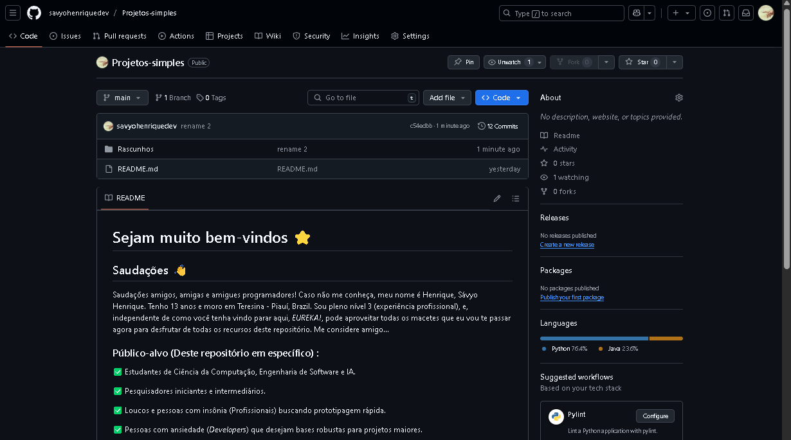

# Sejam todos muito bem-vindos ⭐
## Saudações 👋
Saudações amigos, amigas e amigues programadores! Caso não me conheça, meu nome é Henrique, Sávyo Henrique. Tenho
13 anos e moro em Teresina - Piauí, Brazil. Sou pleno nível 3 (experiência profissional), e, independente de como você tenha vindo parar aqui, *EUREKA!*, pode aproveitar todas os macetes que eu vou te passar agora para desfrutar
de todas os recursos deste repositório. Me considere amigo...

### Público-alvo (Deste repositório em específico)  :

✅ Estudantes de Ciência da Computação, Engenharia de Software e IA.

✅ Pesquisadores iniciantes e intermediários.

✅ Loucos e pessoas com insônia (Profissionais) buscando prototipagem rápida.

✅ Pessoas com ansiedade (*Developers*) que desejam bases robustas para projetos maiores.

✅ Iniciantes que estão procurando uma base para organizar suas benditas ideias

# Recomendações:

### Quando quiser testar minhas abençoadas máquinas, não use VSCode 100% (Opcional). Se você estiver usando...

**Python: Troque por Pycharm (Jetbrains)**

**Java: Troque por IntelliJ (JetBrains)**

**C++: Use CLion (JetBrains)**

**C: CLion também (JetBrains)**

**JavaScript e qualquer outro conteúdo frontend: WebStorm (JetBrains) ou VSCode**

*Caso você esteja lendo isso por meio de uma batata só use o VSCode mesmo e desconsidere qualquer alternativa
acima* 👍

## Ferramentas 👾:
